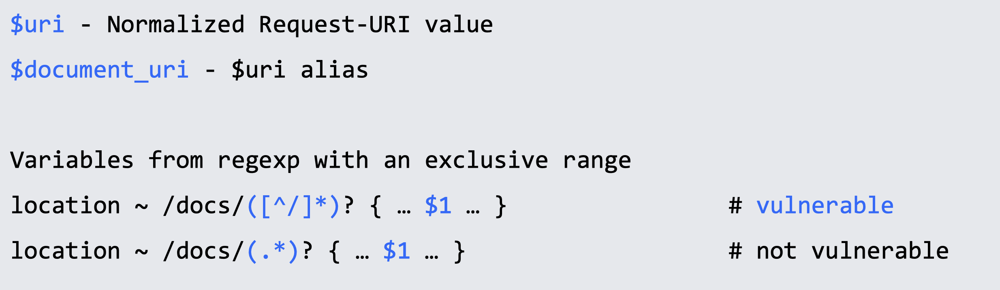
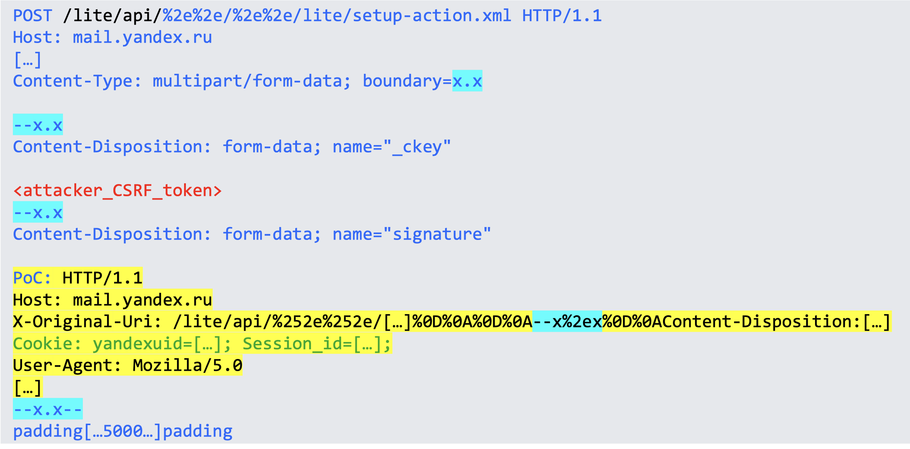
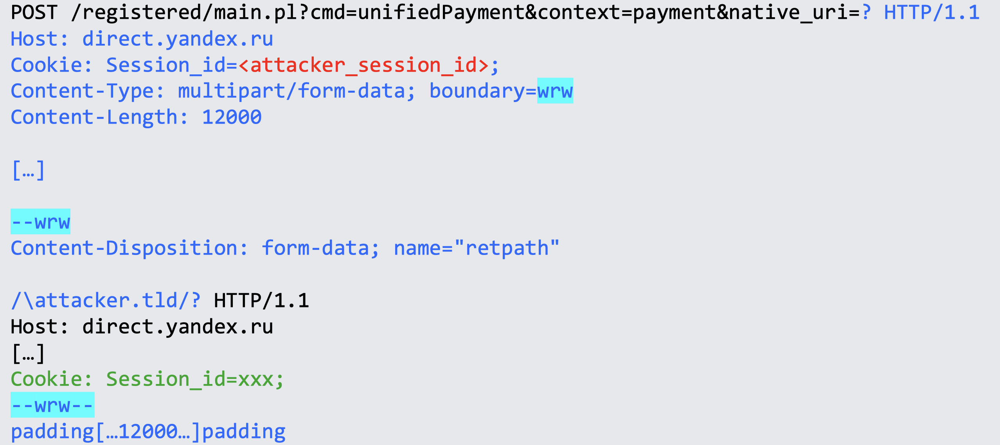
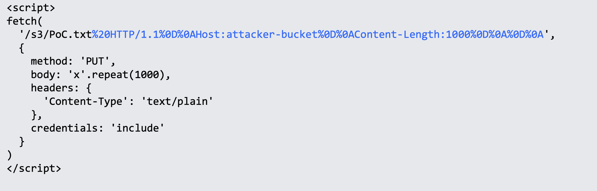
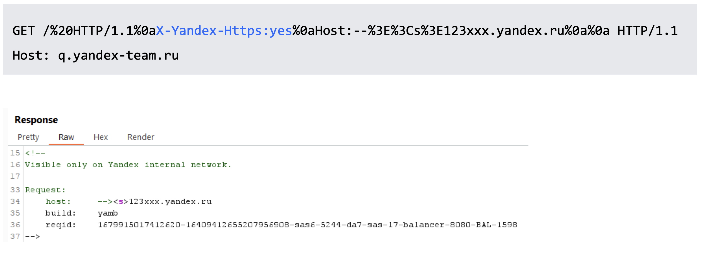
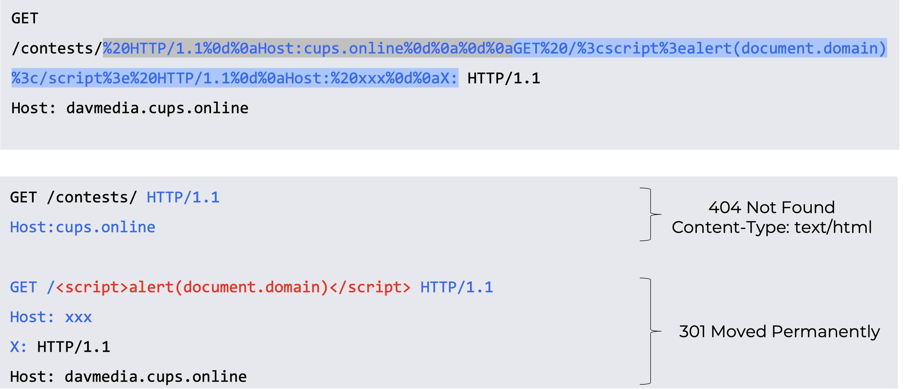
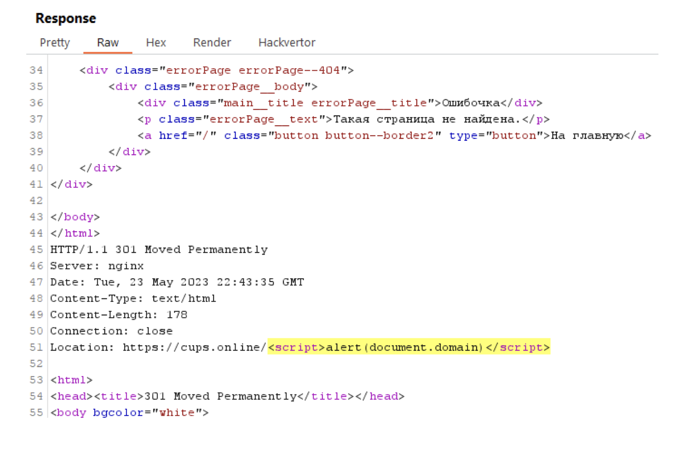

# HTTP Request Splitting vulnerabilities exploitation


这个议题主要分享了HTTP请求拆分漏洞的利用，实际上这并不算是一种漏洞而是nginx的错误配置，类似于：



之所以上面的存在漏洞下面的不存在漏洞，根据gpt的回答是nginx会规范化URI，意味着它会解码编码的字符，包括CR和LF，然后在传递给location指令之前删除它们。这样，就即使输入中含有CR LF字符，也不会被传递到location处理中去，因此标记为不容易受到CRLF注入攻击的影响。


常见的利用情况就是重写了url然后302跳转。

```
return 302 https://company.tld$uri;
```

后续就是讲了5个例子，分别大概说了一些http请求拆分漏洞的利用姿势等。


## 例1

通过路径穿越访问别的服务来盗取cookie，为了绕过分隔符的限制，需要用`multipart/form-data`：



## 例2

通过改成post然后修改参数来实现其他的功能，例如跳转来盗取cookie：



## 例3

重设host来实现访问恶意的s3，通过改成put参数来实现将cookie写入恶意的s3中：



## 例4

比较抽象，是一个根据一个头部来黑盒测试功能，正好是跳转：



## 例5

这个也是议题的分享者说是误打误撞成功的，他自己也不知道为什么会这样：





CRLF注入来实现变成了2个http请求，并且第二个请求的响应在第一个请求的请求体中，可能要多请求几次才会出现，虽然很奇怪但是也算拓展思路了。


## 避免漏洞

使用`$request_uri`替代`$uri`, `$document_uri`，或者正则中排空字符：

```
location ~ /docs/([^/]*)? { … $1 … } # vulnerable
location ~ /docs/([^/\s]*)? { … $1 … } # not vulnerable
```

