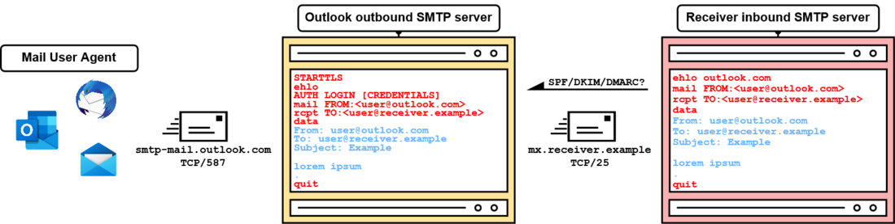
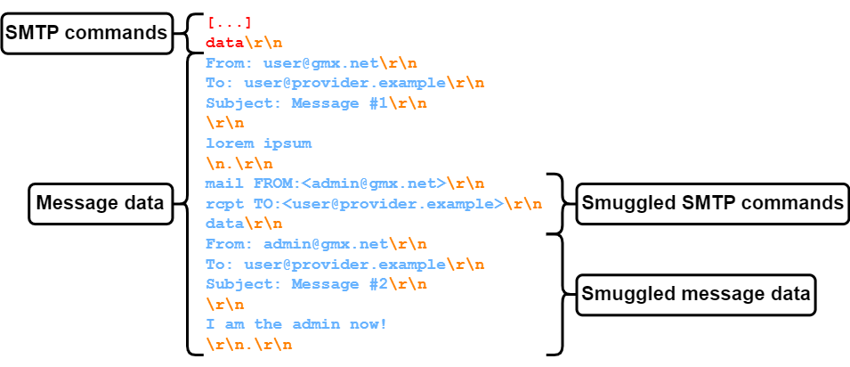
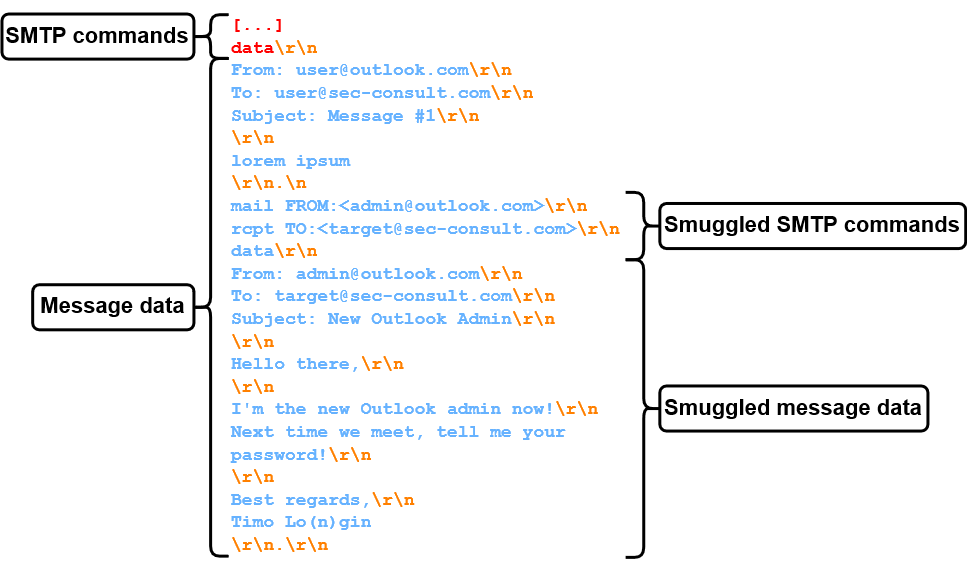
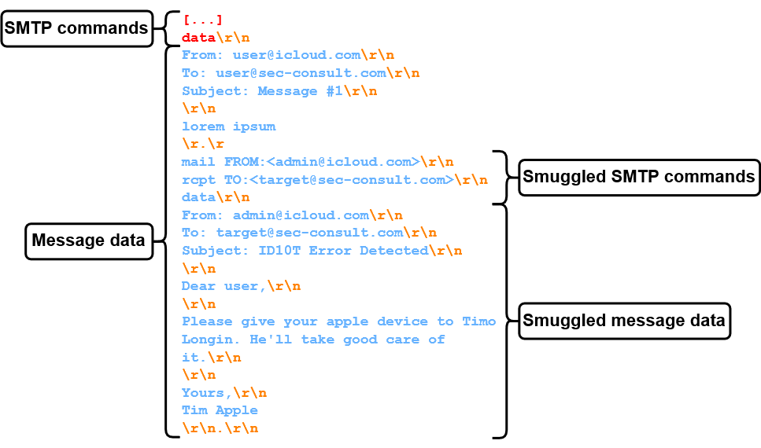

# SMTP Smuggling - Spoofing E-Mails Worldwide - SEC Consult

## 分析

发送邮件的基本流程：

大概就是3方面，用户客户，SMTP出站服务器，SMTP入站服务器。

SMTP入站服务器有3种检验机制：SPF、DKIM 和 DMARC ，可以用来判断出站服务器是否有资格发送对应域的邮件。

**SPF 的**工作原理是允许特殊 SPF/TXT DNS 记录中的发件人 IP 地址，但是问题是只会判断`mail FROM`中的域，DMARC则会标识符对齐，MAIL FROM 和 From 域必须是匹配的。

邮件的data数据结束符号是`\r\n.\r\n`，但是仍然可能会出现**出站和入站 SMTP 服务器对数据结束序列** 的解释不同。此外一些出站服务器会对一些不一样的结束符号（例如`\n.\n`进行一些过滤）。

但是**GMX**的服务器没有对`<LF>.<CR><LF>`进行过滤，通过寻找发现例如`Fastmail`似乎以`<LF>.<CR><LF>`作为结束符号，导致了SMTP走私：

Microsoft Exchange Online同样不会过滤`<LF>.<CR><LF>`，但是Outlook 使用了可选的**BDAT** SMTP 命令。**BDAT 是DATA**命令的替代方法，用于传输消息数据。它的工作原理是使用 BDAT 命令指定消息长度，而不是依赖于数据结束序列。

当入站服务器支持BDAT的话就攻击不了，如果不支持则会选择DATA，因此可以攻击。

最后就是思科的例子，非常有意思，看似会以`<CR>.<CR>`作为结束符，实际上文章最后提到是因为思科安全电子邮件（云）网关可以配置为以特殊方式处理回车和换行，默认配置下会将裸的`\r`和`\n`转换为`\r\n`，因此实际上思科还是以`\r\n`作为结束符，但是因为这个特殊的攻击导致了SMTP走私。

## 总结

文章提到从RFC的规范来看，入站和出站的服务器在处理上都有错误，感觉这个结束符的处理确实是非常难统一的，猜测可能各种协议多少都会有因为解析和处理的不统一造成走私问题。

## References

[SMTP Smuggling - Spoofing E-Mails Worldwide - SEC Consult](https://sec-consult.com/blog/detail/smtp-smuggling-spoofing-e-mails-worldwide/)