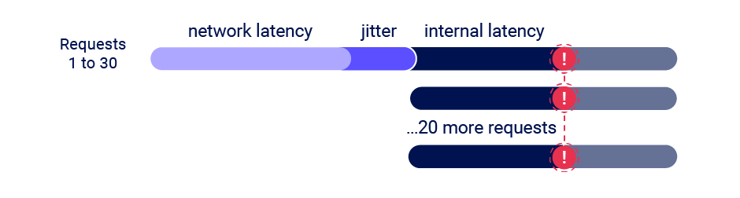
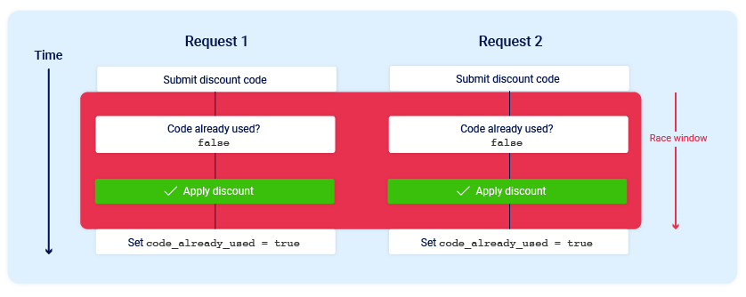
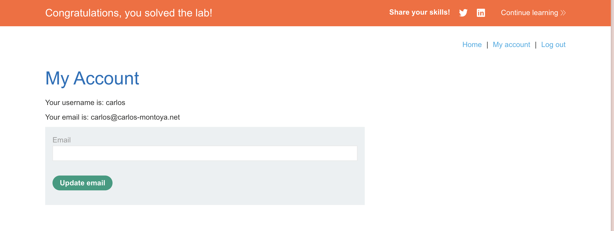
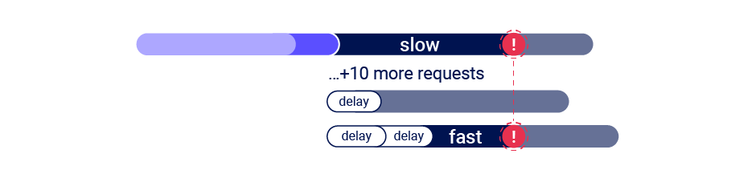

# Smashing the state machine: The true potential of web race conditions

## Introduction

blackhat 2023中有一篇议题《Smashing the state machine: The true potential of web race conditions》中介绍了利用单数据包进行条件竞争这么一个新技术，并且提供了很多的Lab来练习。本文记录的是我阅读议题的paper进行学习和做Lab的过程，部分段落翻译自议题的paper。

**首发于奇安信攻防社区**

## single-packet attack

单数据包攻击技术，就是这篇论文的核心，后续的攻击基本都要依赖这种技术。

它利用了HTTP/2的一个新特性：允许HTTP请求通过单一连接同时发送。在HTTP/1.1中，它们必须是顺序的。

使用单个TCP数据包完全消除了网络抖动的影响，并结合HTTP/1.1的最后字节同步技术的一个技巧。由于服务器只有在认为请求完成后才处理请求，通过从每个请求中保留一小部分数据，可以预先发送大部分数据，然后用单个TCP数据包“完成”20-30个请求。



实现单数据包攻击的关键功能是多路复用：**在单个连接上支持多个并发消息**

首先，预先发送每个请求的大部分内容：

- 如果请求没有主体，则发送所有头部，但不设置END_STREAM标志。保留一个带有END_STREAM设置的空数据帧。


- 如果请求有主体，则发送标头和除最后一个字节之外的所有主体数据。保留包含最后一个字节的数据帧。

接下来，准备发送最后的帧：

- 等待100毫秒以确保初始帧已经发送。


- 确保TCP_NODELAY被禁用（意味着启用Nagle算法）


- 发送一个ping数据包来预热本地连接。如果不这样做，操作系统网络堆栈将把第一个finalframe放在单独的数据包中。

最后，发送被保留的帧。


## Limit overrun race conditions

超过限制的条件竞争，最常见的条件竞争，利用小的竞争窗口：



要实现这个条件竞争，Burp Suite 2023.9为Burp Repeater增加了强大的新功能，可以轻松地发送一组并行请求，从而大大减少其中一个因素的影响，即网络抖动。Burp会自动调整其使用的技术以适应服务器支持的HTTP版本：

- 对于HTTP/1，它使用经典的最后字节同步技术。
- 对于HTTP/2，它使用**单数据包攻击技术**，在Black Hat USA 2023由PortSwigger Research首次展示。

### Lab: Limit overrun race conditions

要买价值1337刀的夹克，但是只有50刀。有一个应用折扣的步骤，通过尝试发现这个与session相关，因此可以猜测处理的流程：从数据库中查看当前session的折扣是否使用，如果没有使用则应用到购物车的总金额中，并将数据库的折扣设置为已使用。

因此可能存在条件竞争漏洞，利用bp重复打开20个repeater，放到一个组中，选择`single-packet attack`：


多次尝试后发现折扣被多次使用，低于50刀，可以购买：


### Lab: Bypassing rate limits via race conditions

主要是改成用bp的**Turbo Intruder**插件。

环境主要就是用户名密码的爆破，但是一个用户名尝试3次后就会锁定，因此尝试次数与用户名相关联而不是session。因此考虑提交登录尝试和网站增加与特定用户名关联的失败登录尝试次数的计数器之间存在**竞争窗口**。

攻击：


将password改成`%s`并在python代码中爆破。


爆破成功后拿session登录然后删除用户即可。


## Hidden multi-step sequences

隐藏的多步骤序列，即一个单个请求实际上背后可能隐藏有多个子状态的转换

### Lab: 2FA simple bypass

猜测处理逻辑是这样的：

1. 判断用户名密码是否正常，正常则生成可以使用的session
2. 接着跳转到`/login2`页面，要求输入2FA code
3. 如果输入正确则跳转到account页面，如果输入错误则将session设置为无效。

因此存在这样的逻辑漏洞，登录成功后直接拿session访问account页面即可，无需输入2FA code。



```

    session['userid'] = user.userid
    if user.mfa_enabled:
        session['enforce_mfa'] = True
        # generate and send MFA code to user
        # redirect browser to MFA code entry form
```

## Methodology

paper的作者提出了一种检测和利用隐藏的多步骤序列的**方法论**


### 1.Predict potential collisions

预测潜在的碰撞。需要考虑三点：

1. 状态如何存储。如果存储在服务器端则可能可以利用，如果存储在客户端则基本不用考虑。
2. 编辑还是追加。如果是对数据编辑则有可能，如果是追加则除了Limit overrun race conditions攻击基本没有别的攻击类型的可能。
3. 按什么操作。对session操作还是用户名操作？等等

### 2.Probe for clues

探索线索。实际上就是测试了，具体的测试步骤类似于模糊测试。下面是大概的两个方向：

1. 首先需要对端点在正常条件下的行为进行基准测试。利用用bp的repeater的Send group in sequence (separate connections) 
2. 然后使用单数据包攻击进行测试（非HTTP2用last-byte sync技术）
3. 从中寻找不同之处（线索）

### 3.Prove the concept

证明概念。即发现线索后进行思考和排查，排除其他的因素，证明该概念并将其转化为可行的攻击。


具体的方法论可以看paper。


## Multi-endpoint race conditions

多端点的条件竞争。

### Lab: Insufficient workflow validation

购买流程流程如下：

1. 将商品添加到购物车
2. 付款：`POST /cart/checkout`
3. 确认订单：`GET /cart/order-confirmation?order-confirmed=true`


存在的漏洞就是在确认订单的时候，没有充足的验证，没有验证当前购物车的总金额和付款的金额是否一致，导致了攻击。攻击流程：

1. 先将便宜的商品添加到购物车中。
2. 付款：`/cart/checkout`。
3. 将jacket添加到购物车中。
4. 确认订单：`GET /cart/order-confirmation?order-confirmed=true`


如果付款和订单确认是由同一个请求处理的时候，就会有一种变体：


这时候就需要在支付成功到确认订单完成这段时间窗口内进行条件竞争。


### Aligning multi-endpoint race windows


在实现多端点条件竞争时，，即使用单数据包技术同时发送所有请求，也可能遇到需要对齐每个请求的竞争窗口的问题。


这可能由下面两个原因导致：

- 网络架构引入的延迟：例如，前端服务器每次与后端建立新连接时可能会有延迟。使用的协议也可能有重大影响。
- 端点特定处理引入的延迟：不同的端点在其处理时间上天生就存在差异，有时这种差异取决于它们触发了什么操作。


#### Connection warming

后端连接延迟通常不会干扰条件竞争，因为它会同等地延迟并行请求，导致这些请求虽然存在延迟，但是彼此仍然算是同步的。

可以用连接预热来判断延迟是否由端点特定因素引起。在Burp Repeater中，在标签组开头添加一个`GET /`请求，然后使用**Send group in sequence (single connection)**选项。如果第一个请求仍然有较长的处理时间，但其余的请求现在都在短时间窗口内处理完毕，则说明是则说明不是由端点特定因素引起，可以忽略延迟继续测试。


#### Abusing rate or resource limits

如果连接预热没有造成差别，那说明可能确实是由端点特定因素引起，因此有两种解决办法。

一种就是引入短暂的**客户端延迟**，即通过多次请求确定两个端点之间延迟差别的时间，让处理更快的请求之前加上这么一个短暂的延迟。相应的就会导致无法使用单数据包攻击技术。


第二种方法是利用一项常见的安全功能。如果发送请求过快且数量过多，Web服务器通常会延迟处理这些请求。通过发送大量虚假请求故意触发速率或资源限制，可以造成适当的**服务器端延迟**。这种情况使得单数据包攻击变得可行。




### Lab: Multi-endpoint race conditions

这个实验经过测试想要条件竞争有两个端点，一个是`GET /cart/checkout`付款并确认订单，一个是`POST /cart`将商品添加到购物车中。因为付款和订单确认都是在`/cart/checkout`中处理（上图），因此竞争窗口会非常小。

在基准测试阶段，如果将`POST /cart`和`POST /cart/checkout`放在一个组然后执行`Send group in sequence (single connection)`多次，会发现每次第一个请求都会比第二个请求延迟大一半甚至一倍，尝试用连接预热的方法，发现`GET /`请求仍然有较长的处理时间，其他的两个请求执行时间会缩短，`POST /cart`经常延迟会比`POST /cart/checkout`小，就说明这种延迟是由后端连接延迟导致，不会干扰条件竞争。

因此直接将`POST /cart/checkout`和20个`POST /cart`放在同一个组然后执行单数据包攻击，多次尝试即可成功。


## Single-endpoint race conditions

如果一个端点足够复杂也可能存在条件竞争，例如下面的设想情况：


现实生成中电子邮件地址确认或任何基于电子邮件的操作通常是单端点条件竞争的一个很好目标，因为电子邮件通常在服务器向客户端发出HTTP响应后，在后台线程中发送，导致存在一个竞争窗口。


### Lab: Single-endpoint race conditions

这个实验实际上是paper中提到的Gitlab邮箱修改的那个例子。

逻辑产生漏洞的原因是在更改电子邮件时，会更新user.unconfirmed_email，将token保存在user.confirmation_token中，并将包含令牌的link通过电子邮件发送到user.unconfirmed_email。这里的email是从http参数中取到的。

```ruby
self.unconfirmed_email = self.email // from 'email' parameter...
self.confirmation_token = @raw_confirmation_token = Devise.friendly_token
...
// this eventually gets handed off a different thread to render & send the email
send_devise_notification(:confirmation_instructions, @raw_confirmation_token, { to: unconfirmed_email } )
```

但在构造邮件内容的时候，email和token都是从数据库中提取的：

```ruby
// an email is queued to the unconfirmed_email argument
// but the body is generated via a template engine reads the variables back from the database
- confirmation_link = confirmation_url(@resource, confirmation_token: @token)
- if @resource.unconfirmed_email.present? || !@resource.created_recently?
#content
    = email_default_heading(@resource.unconfirmed_email || @resource.email)
%p= _('Click the link below to confirm your email address.')
#cta
= link_to _('Confirm your email address'), confirmation_link
```

因此存在这么一个竞争窗口，第一次更新邮箱请求发送后后端会发送电子邮件，邮件发送前后端处理了第二个更新邮箱请求，将第二个邮箱地址和token写到了数据库中。因此如果第一次发送的邮件内容出现了第二次的邮箱，就说明竞争成功。


## Session-based locking mechanisms

例如php session的原生处理模块一次只会处理session相关的一个请求，可能要使用不同的sessionid发送请求。

## Partial construction race conditions

许多应用程序在创建对象时需要经过多个步骤，这可能会引入一个临时的中间状态，在该状态下对象是可以被利用的。具体例子看Lab就行。


### Lab: Partial construction race conditions

这个实验开始有点现实渗透的意思了，也是Partial construction race conditions一个典型的例子。

后端注册的逻辑大概就是先将用户名、密码、邮箱存入到数据库中，然后生成这个邮箱对应的token发送到邮箱并将token存入数据库中。用户在邮箱中查收token并验证就可以通过注册了。

对应的漏洞就是，存在这么一个竞争窗口，用户名、密码、邮箱存入到数据库之后，生成token存入数据库之前，在这个窗口中token实际上是null，因此这时候的confirm接口传一个等同于null的token就可以验证通过。


confirm接口是从`/resources/static/users.js`中找到，通过测试发现`POST /confirm?token[]=`的响应结果是`"Incorrect token: Array"`而不是`forbidden`，因此等效于null。

拿**Turbo Intruder**中的`examples/race-single-packet-attack.py`攻击：

```python
def queueRequests(target, wordlists):

    # if the target supports HTTP/2, use engine=Engine.BURP2 to trigger the single-packet attack
    # if they only support HTTP/1, use Engine.THREADED or Engine.BURP instead
    # for more information, check out https://portswigger.net/research/smashing-the-state-machine
    engine = RequestEngine(endpoint=target.endpoint,
                           concurrentConnections=1,
                           engine=Engine.BURP2
                           )
    confirmationReq = '''POST /confirm?token[]= HTTP/2
Host: 0a4e00ff043eb735814e490200960010.web-security-academy.net
Cookie: phpsessionid=BRTkAgx6CPAghuEp5LnJpmdoRvynz5es
Content-Length: 0

'''
    # the 'gate' argument withholds part of each request until openGate is invoked
    # if you see a negative timestamp, the server responded before the request was complete
    for i in range(20):
        username = 'ff'+str(i)
        
        engine.queue(target.req, username,gate='race1')
        for j in range(20):
            engine.queue(confirmationReq, gate='race1')

    # once every 'race1' tagged request has been queued
    # invoke engine.openGate() to send them in sync
    engine.openGate('race1')


def handleResponse(req, interesting):
    table.add(req)

```


## Time-sensitive attacks

时间敏感的攻击实际上不算严格意义上的条件竞争，利用单数据包技术可以在一定次尝试哪实现两次请求的时间戳相同，这就让后端内通过时间戳生成的一些类似token等有可能出现碰撞。具体看Lab的例子。


### Lab: Exploiting time-sensitive vulnerabilities

密码重置需要输入的token的产生是根据时间戳生成的，因此利用单数据包技术有机会让两次请求的token相同。

在测试时可以尝试将重置`wiener`用户密码的两个请求放在一个数据包中发送，并且考虑到PHPsession，让这两个请求用不同的session。多次发送后在邮箱中可以发现碰撞：


说明确实存在漏洞，将其中一个请求的用户名改成`carlos`多次尝试就可以碰撞token，实现`carlos`用户的密码重置。

## How to prevent race condition vulnerabilities

最后则是总结了如何阻止条件竞争漏洞：

- 避免混合使用不同来源的数据。
- 确保敏感的端点利用数据存储的并发特性来保证状态的改变是原子化的。例如，使用单独的数据库事务来检查支付金额是否与购物车价值匹配并确认订单。
- 利用数据存储的完整性和一致性特征(如唯一性约束)来作为深度防御措施，
- 不要试图使用一个数据存储层来保护另一个。例如，不要用session来保护数据库不受limit-overrun攻击
- 确保您的session处理框架保持session的内部一致性。
- 某些架构可能非常适合不在服务器端保存状态信息，可以使用加密技术(例如JWT)将状态信息存储在客户端。但使用JWT也并不是完全没有风险。

## References

[Race conditions | Web Security Academy](https://portswigger.net/web-security/race-conditions#connection-warming)

[Smashing the state machine: the true potential of web race conditions | PortSwigger Research](https://portswigger.net/research/smashing-the-state-machine#deferred)