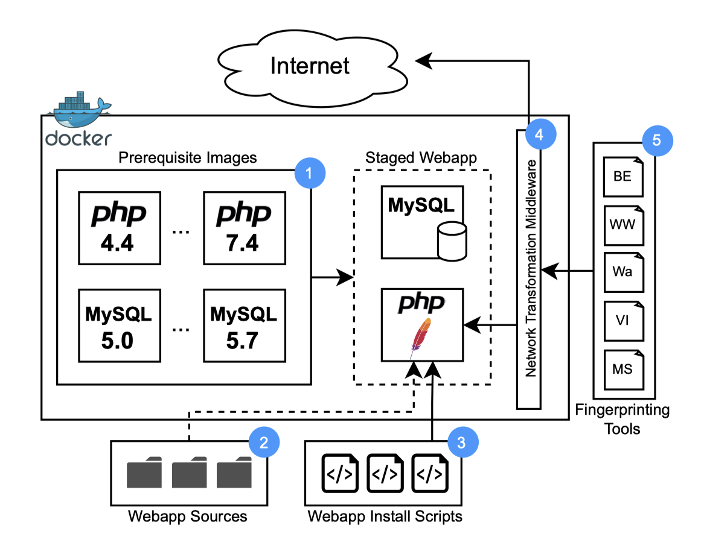

# Smudged Fingerprints: Characterizing and Improving the Performance of Web Application Fingerprinting

发表在USENIX 2024 秋的一篇论文，非常经典的传统web，关于web应用程序指纹识别的文章，看到居然是篇这样的传统web的文章就惊了。

主要内容就是作者研究了好几个web应用程序指纹识别工具在lab（用docker自己搭建的一个可以测试几个php项目，例如wordpress、phpmyadmin、joomla等的各种版本的环境）和对真实环境的上述web应用程序进行指纹识别（应用程序的类型、大版本、小版本等）。

然后设计了一个中间件，这个中间件可以通过Cache-breakers（让请求hit后端的服务器而不是缓存服务器）、Web Path Prediction（用一个算法来避免如果一个网站是在`/aaa/`下面的话，指纹识别的文件应该是`/aaa/`下面而不是根目录下吗）、Real-browser Web Requests（用浏览器访问url来避免被检测成bot）等技术来在**不改变指纹识别工具**的情况下提升工具的准确率和性能（这种思路很好）。

这篇文章前面基本就是介绍web应用程序指纹识别技术（静态和动态），然后后面是lab的设计、中间件的设计、实验设置和实验结果等等。

总的来说感觉没别的顶会文章那样惊艳，但是内容还是不错的。